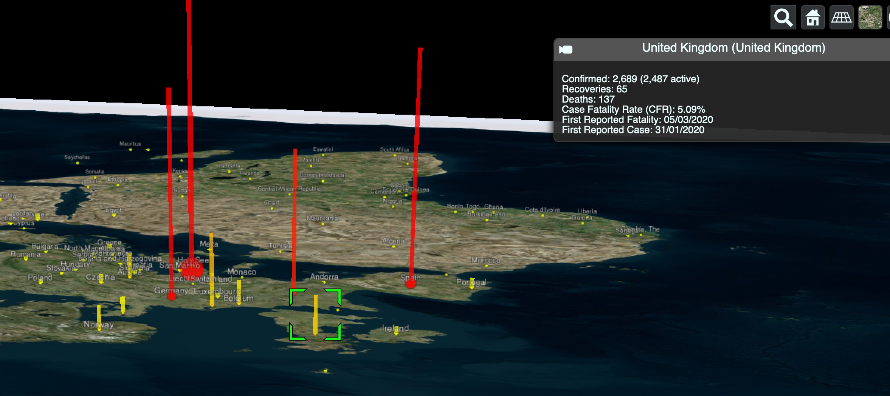

# covid_cleaned_data
Cleaned / processed data from various public COVID-19 datasets in readily ingestible JSON format

## JHUSS Timeseries

Data based on [JHUSS timeseries](https://github.com/CSSEGISandData/COVID-19/tree/master/csse_covid_19_data/csse_covid_19_time_series) in various formats

1. /czml/timeseries.czml - Cases/Deaths/Recoveries time-series in [CZML](https://github.com/AnalyticalGraphicsInc/czml-writer/wiki/CZML-Guide).
 - Inclusive any changes from 2 
 - Recoveries are displayed as proportional to highest single report poly-lines and circles
 - Yellow to red color for hue shift based on proportions
 - Labels for Countries
 - Detailed descriptions for any available location for cases/deaths/recoveries and CFR
 
 

2. /json/jhuss_timeseries.json - Cases/Deaths/Recoveries time-series based on aggregated and cleaned as JSON object 

Transformation:
  - Forward filled Cases/Deaths/Recoveries per day meaning that cases no longer drop to 0 after they emerged due to lack of updates. This means points no longer disappear.
  - Currently locations are based on the confirmed table. There are inconsistencies in Long/Lat being different in Deaths and Recoveries.
  - Aggregated all 3 original timeseries into one.
  - Dropped all 0 case objects

